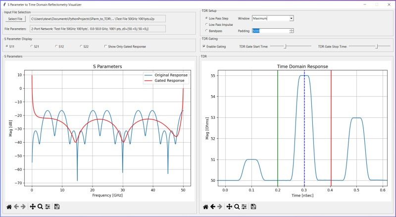

# S-Parameter-to-TDR-Viewer
A S-Parameter to TDR Viewer using Scikit-rf  
  
Many Circuit Analysis, EM Solver programs and lower cost Network Anayzers can measure circuits, but can only produce S-Parameter files.  
With this program you can read and convert those S-Parameter files to a Time Domain Reflectrometry (TDR) view.  
  
An Example:  
This circuit consisting of some different impedance transmission lines can be analyzed by a frequency domanin Circuit Analysis program,  
  
)  
  
To get the TDR view from the S-Parameter file - you can use the program presented here,  
  
  
  
See the 'Users Guide' for a full walk through of the program.  
  
Instaling the program,  
1) Get the code from the src directory.  
2) Use the requirements.txt file to get the proper python libraries.  
3) Double Click on the file: sparam_to_tdr.py to run the program.  
